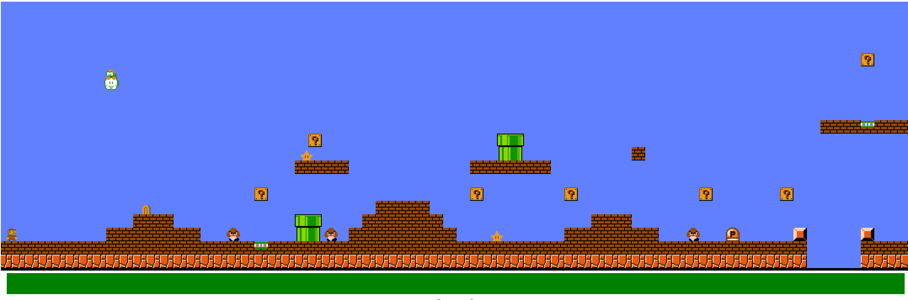

# Mario-Game-in-Python
This is a 2D style Mario Game written in Python using tkinter

# Running
  Install python:
- $pip install py2exe

  Run the game:
- $python MarioApp.py

# Controls
- Left: 'A' button
- Right: 'D' button
- Jump: 'W' button
- Down: 'S' button

# Current State

